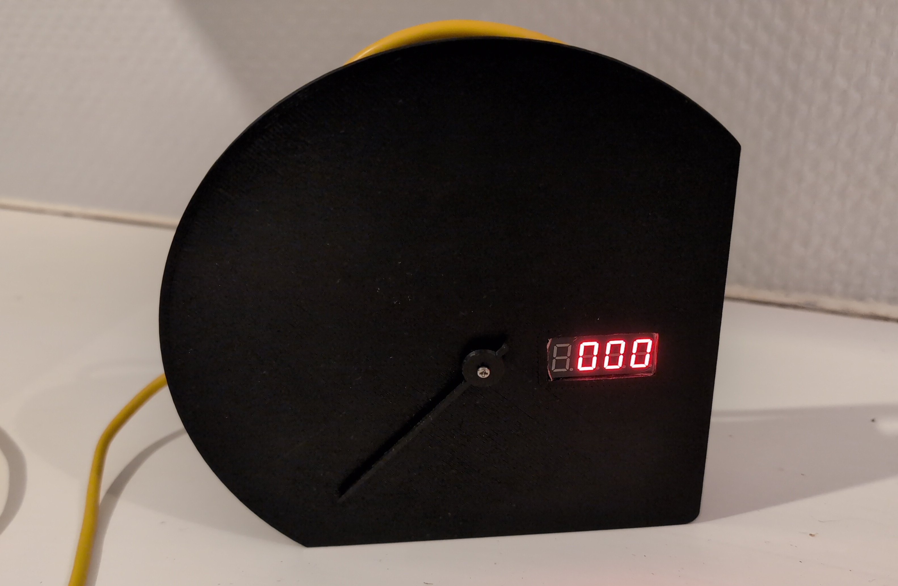
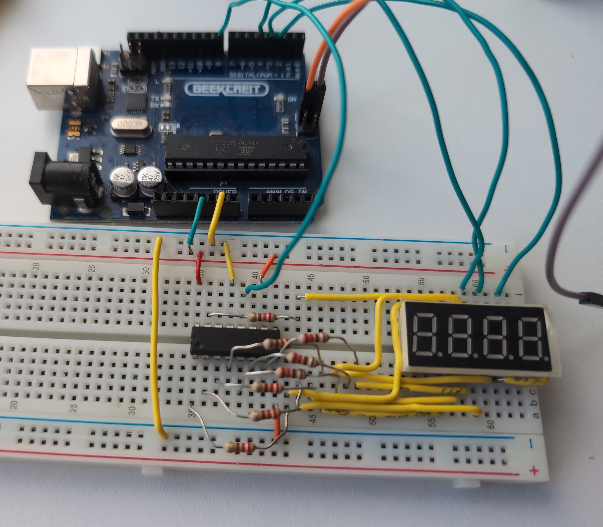
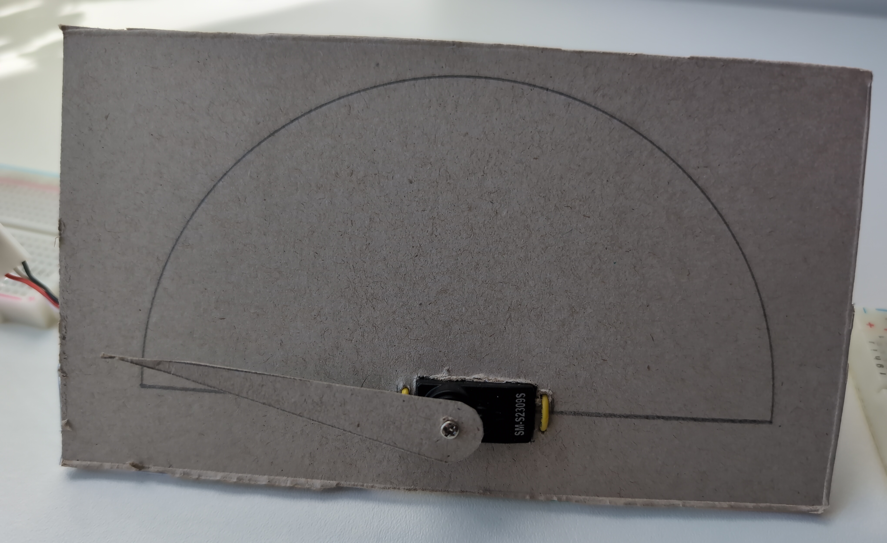
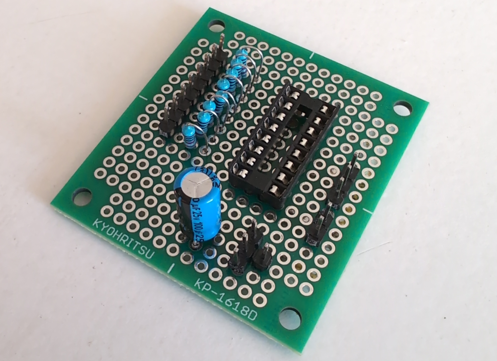
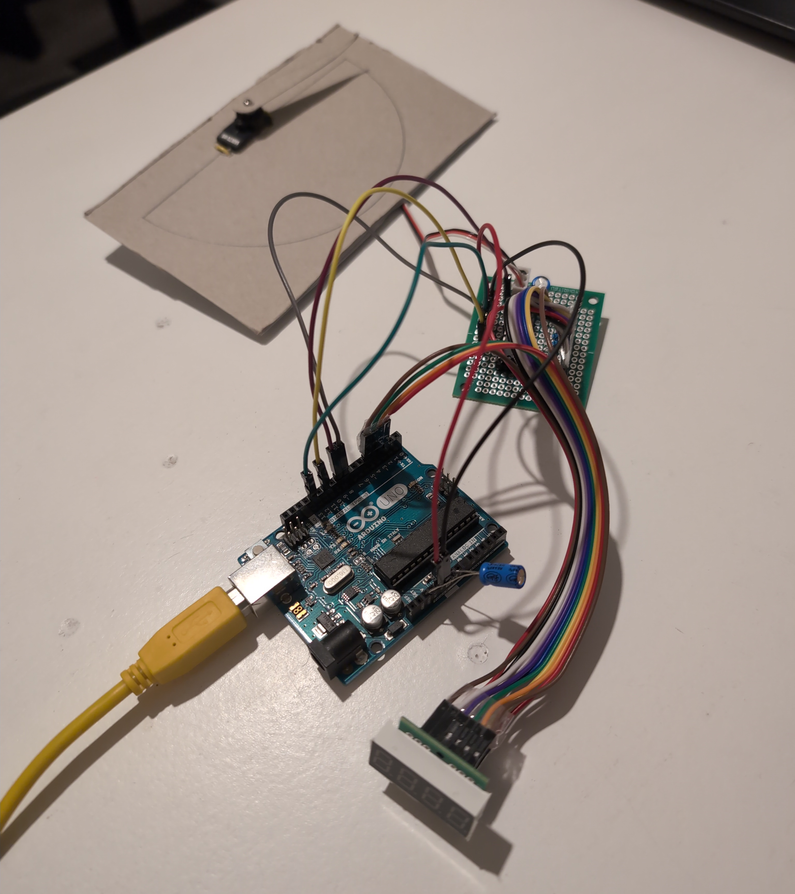
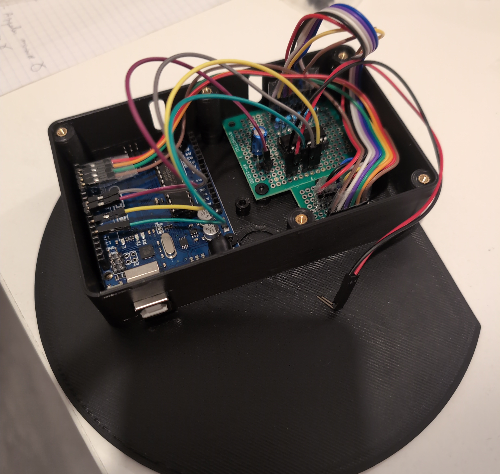

# Arduino Speedometer
This is a speedometer for sim racing, built using an Arduino, a servo motor and a four-digit, eight-segment display.  

This speedometer displays analogue engine RPM via the servo motor and digital speed in km/h via the four-digit LED display.  

The server is programmed in C and currently support only Forza Horizon 4.
The game is configured to send data packets to the server. The server parses the packet and only uses the RPM and speed and send it to the Arduino via UART in a special byte format that compresses the RPM and the speed into 3 bytes.

## Planned improvements
- Update it to support other games, such as Forza Horizon 5 (not tested but should be straightforward) and Assetto Corsa (specific logic needs to be done for this game).  
- Improve visuals with a white dial across all the half circle.  
- Paint the needle red to make it more visible.  

# Build
I wanted to build something modular, reparable and with off the shelf components, specifically what I have lying around.

That's why I used an Arduino UNO as the microcontroller.
I also used a 3461BS as the 4 digits 8 segments display paired with a HC595 8 bit shift register.

The first prototype was realised with a breadboard and cardboard.

*First prototype with all the components mounted on a breadboard and the servo attached to a cardboard dial*

I then created a custom board for all the components.
All the resistors, the DIP socket for the HC595 and a decoupling capacitor for the servo motor were mounted and soldered on a stripboard for a clean finished product.

*Hand soldered stripboard :) you don't want to look to the other way.*

Pins were also soldered to facilitate connections between this board and the Arduino and the 3461BS.

The custom board was tested with everything plugged in.

*Prototype cardboard speedometer using the stripboard*

I designed the shell in FreeCAD to learn 3D modelling and then 3D printed it in PLA.
I then assembled everything into a tiny and neat product.

*Fitting all components together in the tight shell. Threaded inserts were used to facilitate screw mounting of the components and to allow disassembly!*

# Work Reference
STEP files used as 3D reference for case design:  
- https://www.printables.com/model/360145-micro-servo-3d-model-stp/files
- https://www.printables.com/model/358867-arduino-uno-3d-model-stp/files